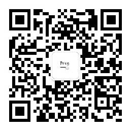

# dyEnhance
## 一、前期说明
> 本项目整体上会介绍两种agent加载方式，一种是被测系统启动时加载agent，一种是被测系统运行时加载agent,让大家对agent有一个整体的概念
> 
> 本项目最终的呈现效果将展现为：方法耗时、入参返回参数的监控等（后面再补充）
> 
> 
> 
> ### 技术层面：
> 
> - **字节码增强技术：** 广泛被使用的有javassist和ASM，前者开发更快速、学习难度低，但是性能上不如后者，后者学习难度较高，但是性能上会更强一些，一般商用项目都采用的ASM.这两种技术本项目都会讲到，文章会更新到公众号 `程序艺术室` 和 [CSDN-点击跳转至博客专栏](https://blog.csdn.net/weixin_42424330/category_10717025.html)
> 
>- **命令行技术：** 会使用到args4j

